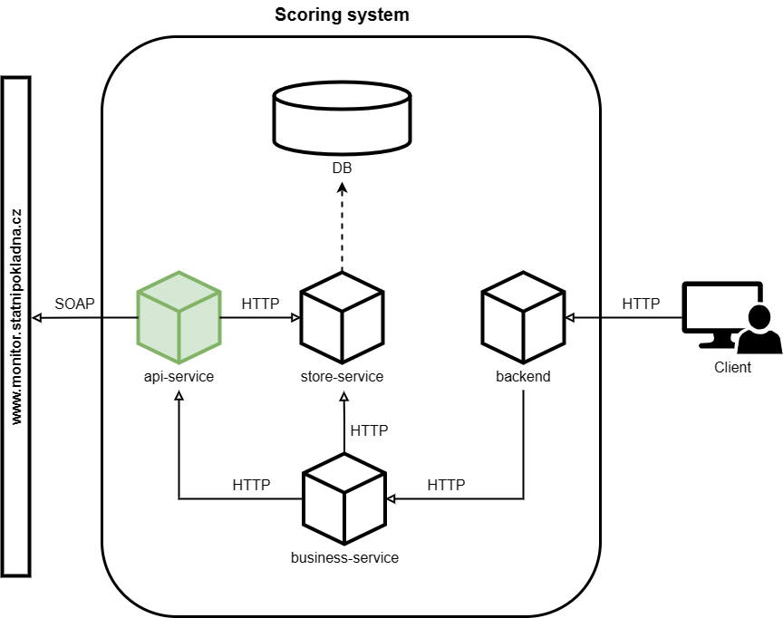

# Api-service

<div style="text-align:center;">
  
</div>


Api-service is tasked with retrieving data from the Ministry of Finance portals. This service provides this data to the business-service and stores this data in a database using the store-service.

## Scoring system setup
- For the easiest way to run the whole system, go to www.github.com/pilarmi2/scoring-system-setup. If you want to run the service locally, continue reading.


## Prerequisites
- Python 3.9 or higher is required for localized execution.
- Required libraries are listed in `requirements.txt`.

## Installation
1. Ensure Python 3.9 is installed on your system.
2. Clone this repository to your local machine.
3. Navigate to the project directory.

## Setup
1. Install the required libraries listed in `requirements.txt` using pip:

```pip install -r requirements.txt```

## System variables
- The following environment variables need to be set for proper functionality.
  - **PORT** (Port on which the service will run)
  - **HOST** (Address the service will run on)
  - **STORE_SERVICE** (Store-service address)
  - **MONITOR**="https://monitor.statnipokladna.cz/api/monitorws"
  - **ARES**="https://ares.gov.cz/ekonomicke-subjekty-v-be/rest/ekonomicke-subjekty"

## Usage
1. Run the main script using Python 3.9:

```python main.py```

## Additional Notes
- It's recommended to set up a virtual environment before installing the required libraries to avoid conflicts with existing packages.
- Ensure that Python 3.9 is added to your system's PATH variable for easy access.
